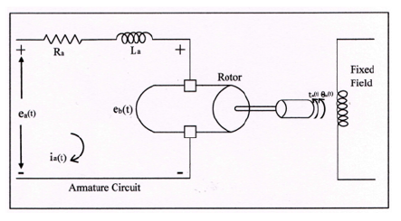

# DC Servo Motor Control: Observer-Based State Feedback Controller Design
This repository contains the experimental study and implementation of an observer-based state feedback controller for a DC servo motor. The main goal of this project is to design and implement a control strategy that estimates and controls the angular position of a DC servo motor using a Luenberger Observer and state feedback control law.

## Project Overview
In this study, we employ **Full State Feedback Control** and **Luenberger Observer** to estimate the motor states and implement feedback control. The control strategy is experimentally validated using a hardware setup that includes a DC servo motor, Arduino Uno, and a motor driver.

### Key Features:
*   **DC Servo Motor:** A brushless DC motor used to achieve precise angular position control.
*   **System Identification:** Grey-box modeling is used to identify the motor parameters (motor gain and time constant).
*   **State-Space Representation:** The DC motor is modeled using a state-space approach to facilitate observer and controller design.
*   **Luenberger Observer:** A state observer designed to estimate unmeasured states from the input and output of the motor.
*   **Full State Feedback Control:** A controller that adjusts the motor input based on the estimated states to achieve the desired angular position.

## Hardware Setup
*   **DC Servo Motor:** AndyMark-4252, 12V, with an inbuilt optical encoder.
*   **Motor Driver:** Cytron MD10C.
*   **Microcontroller:** Arduino Uno.
*   **Power Supply:** 12V DC power supply.

### Hardware Diagram:
